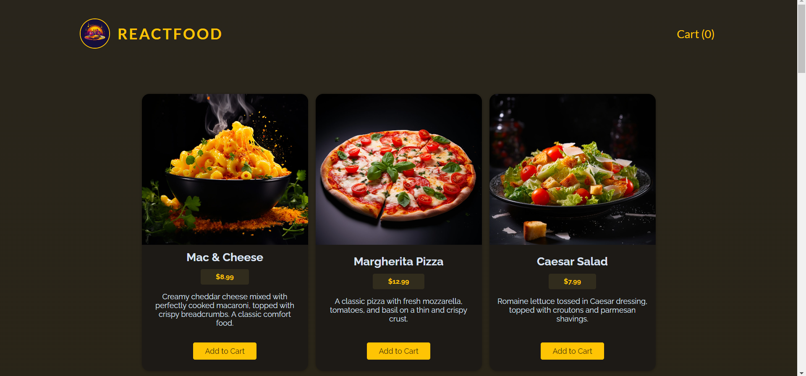
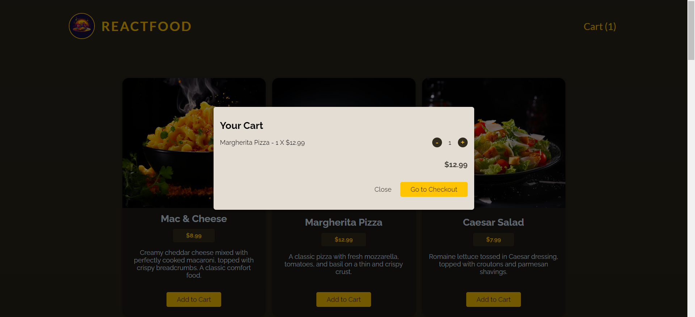
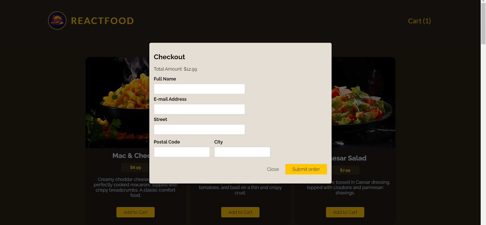
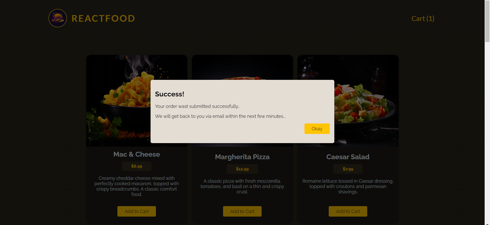

<h1 align="center">ReactFood</h1>
<p align="center">
    
 </p>

<p align="left">
  This is a food delivery app I made with React to demonstrate my understanding and use of the following React concepts. The data is fetched from the backend which is plugged into a Firebase Real Time Database. 
  The customer can add the food items to cart and order from there. Note, this app serves to showcase programmed functional UI abilities rather than UI design and aesthetic:
</p>

- Functional Components
- State Management
- Conditional Rendering
- Styling React Components
- Context API
- React Hooks
  - useState
  - useReducer
  - useEffect
  - useContext
  - useRef
  - useImperativeHandle
- Http Requests
- Form Validation Handling

## 🛠️ Technologies:

- React
- NodeJS
- JavaScript
- CSS3
- HTML5
- Vite

<h2>🚀 Live Demo</h2>

<p>Immerse yourself in its design and functionality with an interactive live demo — simply click the link to explore.</p>

**Live Preview** ➡️ <a href="" target="_blank" rel="noopener noreferrer">Demo</a>

<h2>🖼️ Project Screenshots</h2>

<p>Feel free to check out the screenshots of my website for a sneak peek into its captivating user interface.</p>

<p align="center">
  
</p>

<p align="center">
  
</p>

<p align="center">
  
</p>

<p align="center">
  
</p>

---

# ✨ How to Get Started

## Clone Project:

```bash

git clone https://github.com/Srichandan-09/food-order.git

```

## Install the Dependencies:

```bash

npm install

```

or in short

```bash

npm i

```

## Launch:

```bash

npm run dev

```

## Author

<b>👤 Srichandan</b>

- LinkedIn - [@Srichandan](https://www.linkedin.com/in/srichandan09)
- Github: [@Srichandan-09](https://github.com/Srichandan-09)

Feel free to contact me with any questions or feedback!

## Show your support

Give a ⭐️ if you liked this project!
